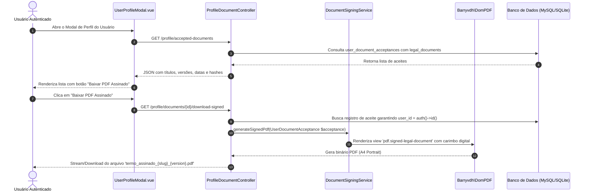

# Especificação Técnica e Funcional: Gestão de Documentos Aceitos e Download de Termos Assinados

**Projeto:** GitPR Site (Documentação & Apresentação Oficial do GitPR CLI)  
**Stack:** Laravel 13.x (PHP 8.3+) | Inertia.js 2.x | Vue 3 (Composition API) | Tailwind CSS 3.x | Dompdf (`barryvdh/laravel-dompdf`) | SHA-256  
**Data:** 20/09/2026  
**Status:** Especificação Técnica Oficial  
**Público-Alvo:** Desenvolvedores (Backend/Frontend), Engenheiros de QA (Testes & Automação) e Product Owners (PO / Jurídico)

---

## 1. Visão Geral e Requisitos de Negócio (PO & Jurídico)

### 1.1 Contexto e Justificativa Legal
Em conformidade com a **Lei Geral de Proteção de Dados (LGPD - Lei 13.709/2018)** e o **Regulamento Geral sobre a Proteção de Dados da UE (GDPR - Regulamento 2016/679)**, a plataforma deve garantir transparência absoluta sobre os consentimentos e acordos jurídicos firmados pelos usuários.

O usuário autenticado deve ter acesso à lista completa de todos os documentos legais aceitos (como Termos de Uso, Políticas de Privacidade e Acordos de Contribuição) e a prerrogativa de efetuar o **download da versão assinada eletronicamente em formato PDF**. Este arquivo serve como instrumento probatório de validade jurídica, contendo carimbo temporal, endereço IP, User-Agent e hash de integridade criptográfica.



---

### 1.2 Regras de Negócio e Casos de Uso

| ID | Regra de Negócio | Comportamento do Sistema |
|---|---|---|
| **RN-DOC01** | **Registro Imutável de Aceite** | Todo consentimento a um documento legal gera um registro com carimbo de tempo UTC, endereço IP do usuário, User-Agent e cálculo de hash SHA-256 inviolável. |
| **RN-DOC02** | **Versionamento de Termos** | Documentos legais possuem controle estrito de versão (ex.: `1.0.0`, `1.1.0`). Atualizações contratuais não sobrescrevem aceites históricos do usuário. |
| **RN-DOC03** | **Carimbo Criptográfico de Assinatura** | O PDF gerado inclui um selo digital contendo o hash calculado a partir da concatenação dos dados do usuário, do termo aceito, da data/hora exata e da chave de assinatura da aplicação (`APP_KEY`). |
| **RN-DOC04** | **Proteção contra Acesso Indevido (Anti-IDOR)** | Um usuário só pode listar e baixar termos associados ao seu próprio `user_id`. Tentativas de acessar IDs de terceiros retornam erro HTTP 404/403. |
| **RN-DOC05** | **Download Imediato e Sob Demanda** | O PDF é renderizado dinamicamente em tempo de execução a partir do snapshot do termo e dos metadados de auditoria, garantindo fidelidade visual e economia de armazenamento em disco. |

---

## 2. Bibliotecas e Dependências Backend

Para a arquitetura Laravel 13 e PHP 8.3+:

1. **`barryvdh/laravel-dompdf` (`^3.0` / `dompdf/dompdf`):**
   - **Função:** Motor principal de renderização de templates Blade (HTML/CSS) para documentos PDF vetorizados e paginados (A4).
   - **Vantagens:** Integração nativa com a Service Layer do Laravel, suporte a UTF-8, quebras de página automáticas (`page-break-inside: avoid`) e baixo consumo de memória.
2. **`simplesoftwareio/simple-qrcode` (`^4.2` - Opcional/Recomendado):**
   - **Função:** Geração de QR Codes dinâmicos em SVG/PNG embutidos no PDF para validação de autenticidade externa.
3. **Extensão PHP Nativa `hash`:**
   - **Função:** Geração de assinaturas HMAC e hashes SHA-256 para comprovação de não-repúdio.

---

## 3. Modelagem de Dados & Migrations

### 3.1 Tabela `legal_documents`
Armazena o catálogo de documentos legais e suas respectivas versões.

```sql
CREATE TABLE `legal_documents` (
  `id` BIGINT UNSIGNED NOT NULL AUTO_INCREMENT,
  `slug` VARCHAR(100) NOT NULL,
  `title` VARCHAR(255) NOT NULL,
  `version` VARCHAR(20) NOT NULL,
  `content_markdown` LONGTEXT NOT NULL,
  `is_active` TINYINT(1) NOT NULL DEFAULT 1,
  `published_at` TIMESTAMP NOT NULL,
  `created_at` TIMESTAMP NULL DEFAULT NULL,
  `updated_at` TIMESTAMP NULL DEFAULT NULL,
  PRIMARY KEY (`id`),
  UNIQUE INDEX `legal_documents_slug_version_unique` (`slug`, `version`),
  INDEX `legal_documents_slug_is_active_index` (`slug`, `is_active`)
);
```

---

### 3.2 Tabela `user_document_acceptances`
Armazena a trilha de auditoria e a assinatura eletrônica de cada consentimento.

```sql
CREATE TABLE `user_document_acceptances` (
  `id` BIGINT UNSIGNED NOT NULL AUTO_INCREMENT,
  `uuid` CHAR(36) NOT NULL UNIQUE,
  `user_id` BIGINT UNSIGNED NOT NULL,
  `legal_document_id` BIGINT UNSIGNED NOT NULL,
  `ip_address` VARCHAR(45) NOT NULL,
  `user_agent` TEXT NOT NULL,
  `signature_hash` VARCHAR(64) NOT NULL, -- SHA-256
  `accepted_at` TIMESTAMP NOT NULL,
  `created_at` TIMESTAMP NULL DEFAULT NULL,
  `updated_at` TIMESTAMP NULL DEFAULT NULL,
  PRIMARY KEY (`id`),
  FOREIGN KEY (`user_id`) REFERENCES `users` (`id`) ON DELETE CASCADE,
  FOREIGN KEY (`legal_document_id`) REFERENCES `legal_documents` (`id`) ON DELETE CASCADE,
  INDEX `user_document_acceptances_user_id_index` (`user_id`),
  INDEX `user_document_acceptances_uuid_index` (`uuid`)
);
```

---

## 4. Models Eloquent

### 4.1 `App\Models\LegalDocument`
```php
namespace App\Models;

use Illuminate\Database\Eloquent\Model;
use Illuminate\Database\Eloquent\Relations\HasMany;

class LegalDocument extends Model
{
    protected $fillable = [
        'slug',
        'title',
        'version',
        'content_markdown',
        'is_active',
        'published_at',
    ];

    protected function casts(): array
    {
        return [
            'is_active' => 'boolean',
            'published_at' => 'datetime',
        ];
    }

    public function acceptances(): HasMany
    {
        return $this->hasMany(UserDocumentAcceptance::class);
    }
}
```

---

### 4.2 `App\Models\UserDocumentAcceptance`
```php
namespace App\Models;

use Illuminate\Database\Eloquent\Model;
use Illuminate\Database\Eloquent\Relations\BelongsTo;

class UserDocumentAcceptance extends Model
{
    protected $fillable = [
        'uuid',
        'user_id',
        'legal_document_id',
        'ip_address',
        'user_agent',
        'signature_hash',
        'accepted_at',
    ];

    protected function casts(): array
    {
        return [
            'accepted_at' => 'datetime',
        ];
    }

    public function user(): BelongsTo
    {
        return $this->belongsTo(User::class);
    }

    public function legalDocument(): BelongsTo
    {
        return $this->belongsTo(LegalDocument::class);
    }
}
```

---

## 5. Serviços e Controladores Backend

### 5.1 Service: `App\Services\DocumentSigningService`
Centraliza a lógica de registro criptográfico de aceite e a geração do documento PDF assinado.

```php
namespace App\Services;

use App\Models\LegalDocument;
use App\Models\User;
use App\Models\UserDocumentAcceptance;
use Barryvdh\DomPDF\Facade\Pdf;
use Illuminate\Support\Str;

class DocumentSigningService
{
    /**
     * Registra o aceite com cálculo de integridade SHA-256.
     */
    public function recordAcceptance(User $user, LegalDocument $document, string $ip, string $userAgent): UserDocumentAcceptance
    {
        $acceptedAt = now();

        // Composição do payload de não-repúdio
        $payload = implode('|', [
            $user->id,
            $user->email,
            $document->id,
            $document->version,
            hash('sha256', $document->content_markdown),
            $ip,
            $userAgent,
            $acceptedAt->toIso8601String(),
            config('app.key'),
        ]);

        $signatureHash = hash('sha256', $payload);

        return UserDocumentAcceptance::create([
            'uuid' => (string) Str::uuid(),
            'user_id' => $user->id,
            'legal_document_id' => $document->id,
            'ip_address' => $ip,
            'user_agent' => $userAgent,
            'signature_hash' => $signatureHash,
            'accepted_at' => $acceptedAt,
        ]);
    }

    /**
     * Renderiza o PDF assinado com carimbo de auditoria.
     */
    public function generateSignedPdf(UserDocumentAcceptance $acceptance)
    {
        $acceptance->load(['user', 'legalDocument']);
        $document = $acceptance->legalDocument;
        $user = $acceptance->user;

        // Converte o conteúdo Markdown do documento para HTML
        $documentHtml = Str::markdown($document->content_markdown);

        $viewData = [
            'document' => $document,
            'documentHtml' => $documentHtml,
            'user' => $user,
            'acceptance' => $acceptance,
            'generatedAt' => now(),
        ];

        return Pdf::loadView('pdf.signed-legal-document', $viewData)
            ->setPaper('a4', 'portrait')
            ->setOption([
                'isRemoteEnabled' => true,
                'defaultFont' => 'sans-serif',
            ]);
    }
}
```

---

### 5.2 Controller: `App\Http\Controllers\ProfileDocumentController`
Endpoints acessíveis somente por usuários autenticados via middleware `auth`.

```php
namespace App\Http\Controllers;

use App\Models\UserDocumentAcceptance;
use App\Services\DocumentSigningService;
use Illuminate\Http\JsonResponse;
use Illuminate\Http\Request;
use Symfony\Component\HttpFoundation\Response;

class ProfileDocumentController extends Controller
{
    /**
     * Retorna a lista de documentos aceitos pelo usuário logado.
     */
    public function index(Request $request): JsonResponse
    {
        $acceptances = $request->user()->documentAcceptances()
            ->with('legalDocument')
            ->latest('accepted_at')
            ->get()
            ->map(fn ($item) => [
                'id' => $item->id,
                'uuid' => $item->uuid,
                'title' => $item->legalDocument->title,
                'slug' => $item->legalDocument->slug,
                'version' => $item->legalDocument->version,
                'accepted_at' => $item->accepted_at->toIso8601String(),
                'signature_hash' => $item->signature_hash,
            ]);

        return response()->json($acceptances);
    }

    /**
     * Realiza o download do PDF assinado.
     */
    public function downloadSigned(Request $request, int $id, DocumentSigningService $service): Response
    {
        // Trava de segurança: garante que o registro pertence estritamente ao usuário autenticado
        $acceptance = UserDocumentAcceptance::where('user_id', $request->user()->id)
            ->where('id', $id)
            ->firstOrFail();

        $pdf = $service->generateSignedPdf($acceptance);
        $filename = sprintf('termo_assinado_%s_%s.pdf', $acceptance->legalDocument->slug, $acceptance->legalDocument->version);

        return $pdf->download($filename);
    }
}
```

---

### 5.3 Definição de Rotas (`routes/web.php`)

```php
Route::middleware('auth')->group(function () {
    Route::get('/profile/accepted-documents', [ProfileDocumentController::class, 'index'])
        ->name('profile.documents.index');
        
    Route::get('/profile/documents/{id}/download-signed', [ProfileDocumentController::class, 'downloadSigned'])
        ->name('profile.documents.download-signed');
});
```

---

## 6. Frontend: `resources/js/Components/UserProfileModal.vue`

Componente de visualização em modal com suporte a temas Claro/Escuro (`dark mode`) e responsividade.

```vue
<template>
    <Modal :show="show" @close="closeModal" max-width="2xl">
        <div class="p-6 bg-white dark:bg-gitpr_dark text-slate-900 dark:text-gitpr_text">
            <div class="flex items-center justify-between pb-4 border-b border-slate-200 dark:border-gitpr_dark_border">
                <h2 class="text-lg font-bold">Documentos e Termos Aceitos</h2>
                <button @click="closeModal" class="text-slate-400 hover:text-slate-600 dark:hover:text-slate-200">✕</button>
            </div>

            <!-- Loading State -->
            <div v-if="loading" class="py-8 text-center text-sm text-slate-500 dark:text-slate-400">
                Carregando documentos aceitos...
            </div>

            <!-- Empty State -->
            <div v-else-if="documents.length === 0" class="py-8 text-center text-sm text-slate-500 dark:text-slate-400">
                Nenhum termo de aceite registrado para este usuário.
            </div>

            <!-- Documents List -->
            <div v-else class="mt-4 space-y-3 max-h-[60vh] overflow-y-auto pr-1">
                <div v-for="doc in documents" :key="doc.id"
                    class="p-4 rounded-lg border border-slate-200 dark:border-slate-700 bg-slate-50 dark:bg-slate-800/40 flex flex-col sm:flex-row sm:items-center sm:justify-between gap-3">
                    
                    <div class="space-y-1">
                        <div class="flex items-center gap-2">
                            <span class="font-semibold text-sm">{{ doc.title }}</span>
                            <span class="px-2 py-0.5 text-xs font-mono rounded bg-slate-200 dark:bg-slate-700 text-slate-700 dark:text-slate-300">
                                v{{ doc.version }}
                            </span>
                        </div>
                        <p class="text-xs text-slate-500 dark:text-slate-400">
                            Aceito em: {{ formatDate(doc.accepted_at) }}
                        </p>
                        <p class="text-[11px] font-mono text-slate-400 dark:text-slate-500 truncate max-w-xs sm:max-w-md" :title="doc.signature_hash">
                            SHA-256: {{ doc.signature_hash }}
                        </p>
                    </div>

                    <a :href="route('profile.documents.download-signed', { id: doc.id })"
                        class="inline-flex items-center justify-center gap-1.5 px-3 py-1.5 text-xs font-medium rounded-md bg-gitpr_primary text-white hover:bg-blue-600 transition-colors shrink-0"
                        title="Baixar versão assinada em PDF">
                        <svg class="w-4 h-4" fill="none" stroke="currentColor" viewBox="0 0 24 24">
                            <path stroke-linecap="round" stroke-linejoin="round" stroke-width="2" d="M12 10v6m0 0l-3-3m3 3l3-3m2 8H7a2 2 0 01-2-2V5a2 2 0 012-2h5.586a1 1 0 01.707.293l5.414 5.414a1 1 0 01.293.707V19a2 2 0 01-2 2z" />
                        </svg>
                        Baixar PDF Assinado
                    </a>
                </div>
            </div>

            <div class="mt-6 flex justify-end">
                <button type="button" @click="closeModal"
                    class="px-4 py-2 text-sm font-medium rounded-md border border-slate-300 dark:border-slate-600 text-slate-700 dark:text-slate-200 hover:bg-slate-100 dark:hover:bg-slate-700 transition-colors">
                    Fechar
                </button>
            </div>
        </div>
    </Modal>
</template>

<script setup>
import { ref, watch } from 'vue';
import Modal from '@/Components/Modal.vue';

const props = defineProps({
    show: { type: Boolean, default: false }
});

const emit = defineEmits(['close']);

const documents = ref([]);
const loading = ref(false);

const closeModal = () => emit('close');

const loadDocuments = async () => {
    loading.value = true;
    try {
        const response = await fetch(route('profile.documents.index'));
        if (response.ok) {
            documents.value = await response.json();
        }
    } catch (e) {
        console.error('Erro ao carregar documentos aceitos:', e);
    } finally {
        loading.value = false;
    }
};

watch(() => props.show, (newVal) => {
    if (newVal) {
        loadDocuments();
    }
});

const formatDate = (isoString) => {
    if (!isoString) return '-';
    return new Intl.DateTimeFormat('pt-BR', {
        dateStyle: 'short',
        timeStyle: 'medium'
    }).format(new Date(isoString));
};
</script>
```

---

## 7. Template Blade do Documento PDF Assinado

Salvo em `resources/views/pdf/signed-legal-document.blade.php`:

```html
<!DOCTYPE html>
<html lang="pt-BR">
<head>
    <meta charset="UTF-8">
    <title>{{ $document->title }} - Versão Assinada</title>
    <style>
        @page {
            margin: 25mm 20mm 25mm 20mm;
        }
        body {
            font-family: 'Helvetica Neue', Helvetica, Arial, sans-serif;
            font-size: 10pt;
            color: #1e293b;
            line-height: 1.6;
        }
        .header-table {
            width: 100%;
            border-bottom: 2px solid #1a80d4;
            padding-bottom: 12px;
            margin-bottom: 20px;
        }
        .title {
            font-size: 15pt;
            font-weight: bold;
            color: #0a192f;
            margin: 0;
        }
        .subtitle {
            font-size: 9pt;
            color: #64748b;
            margin-top: 4px;
        }
        .document-body {
            margin-bottom: 25px;
            text-align: justify;
        }
        .document-body h1, .document-body h2, .document-body h3 {
            color: #0a192f;
            page-break-after: avoid;
        }
        .audit-box {
            border: 1px solid #cbd5e1;
            background-color: #f8fafc;
            border-radius: 6px;
            padding: 14px;
            margin-top: 25px;
            page-break-inside: avoid;
        }
        .audit-title {
            font-size: 11pt;
            font-weight: bold;
            color: #0a192f;
            border-bottom: 1px solid #e2e8f0;
            padding-bottom: 6px;
            margin-bottom: 10px;
        }
        .meta-table {
            width: 100%;
            font-size: 8.5pt;
            border-collapse: collapse;
        }
        .meta-table td {
            padding: 3px 0;
            vertical-align: top;
        }
        .meta-label {
            width: 28%;
            font-weight: bold;
            color: #475569;
        }
        .hash-code {
            font-family: 'Courier New', Courier, monospace;
            font-size: 7.5pt;
            color: #0f172a;
            word-break: break-all;
        }
        .footer {
            position: fixed;
            bottom: -15mm;
            left: 0;
            right: 0;
            text-align: center;
            font-size: 7.5pt;
            color: #94a3b8;
            border-top: 1px solid #e2e8f0;
            padding-top: 5px;
        }
    </style>
</head>
<body>
    <table class="header-table">
        <tr>
            <td>
                <div class="title">GitPR — Comprovante de Assinatura Eletrônica</div>
                <div class="subtitle">Documento: {{ $document->title }} (Versão {{ $document->version }})</div>
            </td>
            <td align="right" style="vertical-align: bottom;">
                <span style="font-size: 8pt; color: #64748b;">ID: {{ $acceptance->uuid }}</span>
            </td>
        </tr>
    </table>

    <div class="document-body">
        {!! $documentHtml !!}
    </div>

    <div class="audit-box">
        <div class="audit-title">Evidências de Conformidade e Assinatura Digital</div>
        <table class="meta-table">
            <tr>
                <td class="meta-label">Titular do Aceite:</td>
                <td>{{ $user->name }} ({{ $user->email }})</td>
            </tr>
            <tr>
                <td class="meta-label">Identificador do Usuário:</td>
                <td>#{{ $user->id }}</td>
            </tr>
            <tr>
                <td class="meta-label">Data e Hora do Aceite:</td>
                <td>{{ $acceptance->accepted_at->format('d/m/Y H:i:s') }} UTC</td>
            </tr>
            <tr>
                <td class="meta-label">Endereço IP Registrado:</td>
                <td>{{ $acceptance->ip_address }}</td>
            </tr>
            <tr>
                <td class="meta-label">Dispositivo / User-Agent:</td>
                <td>{{ $acceptance->user_agent }}</td>
            </tr>
            <tr>
                <td class="meta-label">Hash Criptográfico (SHA-256):</td>
                <td class="hash-code">{{ $acceptance->signature_hash }}</td>
            </tr>
        </table>
    </div>

    <div class="footer">
        Documento gerado eletronicamente pela plataforma GitPR Site em {{ $generatedAt->format('d/m/Y H:i:s') }} UTC.
    </div>
</body>
</html>
```

---

## 8. Matriz de Testes Automatizados e Casos de Borda (QA)

| ID | Cenário de Teste | Ação Realizada | Resultado Esperado | Camada |
|---|---|---|---|---|
| **DOC-01** | Listagem de documentos para usuário autenticado | `GET /profile/accepted-documents` logado como Usuário A | Retorna JSON contendo apenas os aceites onde `user_id = A`. | Feature / API |
| **DOC-02** | Bloqueio de acesso para usuários não autenticados | `GET /profile/accepted-documents` sem sessão ativa | Redireciona para `/login` (HTTP 302/401). | Segurança |
| **DOC-03** | Download do PDF assinado com sucesso | `GET /profile/documents/{id}/download-signed` com ID válido do Usuário A | Retorna stream de arquivo PDF com `Content-Type: application/pdf` e cabeçalho `Content-Disposition: attachment`. | Feature |
| **DOC-04** | Prevenção contra IDOR (acesso a documento de outro usuário) | Usuário B tenta acessar `GET /profile/documents/{id_de_A}/download-signed` | Retorna erro HTTP 404 (`ModelNotFoundException`) ou 403 Forbidden. | Segurança |
| **DOC-05** | Integridade do Hash SHA-256 | Recalcular o hash do aceite no teste com a `APP_KEY` do ambiente de testes | O hash gerado coincide 100% com o `signature_hash` gravado no banco. | Unitário |
| **DOC-06** | Preservação de versões históricas | Publicar versão `2.0.0` do termo | Usuário que aceitou a versão `1.0.0` continua baixando o PDF da versão `1.0.0` que efetivamente assinou. | Regra de Negócio |

